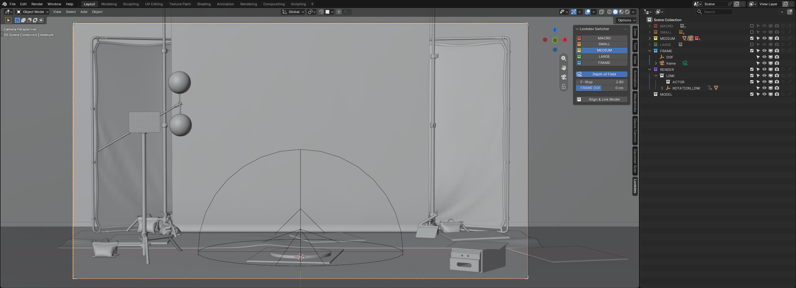
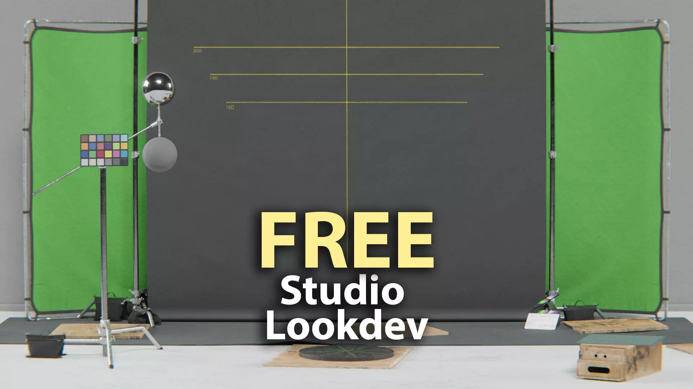

# Lookdev Studio Switcher

Turns a free **Studio Lookdev** scene into a one-click turntable workstation:
switch between five framing configurations, control depth of field, and rig any
imported model for a turntable — all from one panel.

---

## Three steps

### 1. Get the scene

albin. (2021, November 10). *Studio Lookdev* [3D model]. CGTrader.
<https://www.cgtrader.com/free-3d-models/architectural/other/studio-lookdev>

Free, but **not mine** — download it from the author. This repository does not
contain the scene and never will. See [why](#why-you-download-it-yourself).

### 2. Run the script

1. Open the downloaded `.blend`.
2. Open a **Text Editor** → *Open* → `setup_lookdev_scene.py`.
3. Press **Run Script** ▶

### 3. Save it

**File → Save As** → `LOOKDEV_STUDIO.blend`

Keep your original download untouched. That's it — press `N` in the viewport and
pick the **Lookdev** tab.

> **One more thing, once:** enable *Edit → Preferences → Save & Load → **Auto Run
> Python Scripts***. The tool lives inside your `.blend` as a registered text
> block; without auto-run Blender won't start it when you reopen the file.

**Blender 5.2+ recommended.** That is where this was built and tested. The scene
uses ACES 2.0 colour management and the 5.x compositor, so on an older Blender
expect those parts to be skipped.

---

## What the script does

It rebuilds the scene, installs the Lookdev Switcher into it, opens the tool in
the Text Editor, and then deletes itself. It is a one-shot job.

Every step checks before it acts, so running it twice is harmless. It also
verifies it's looking at the right scene first and refuses to touch anything
else.

It does change your render settings, and you will notice: sampling goes from 128
to **512**, and renders come out as **multi-layer EXR** instead of PNG. That is
lookdev quality on purpose. The full list is in the
[reference](docs/DOCUMENTATION.md#what-the-conversion-changes).

Nothing from my own project folders travels with it — the output path is set to
`//`, the folder your `.blend` sits in.

---

## The panel

### Configuration buttons

`MACRO` `SMALL` `MEDIUM` `LARGE` `FRAME`

One click activates that collection — with everything inside it — hides the other
four, and switches to the matching camera. The active button stays pressed. Icon
colours come from the collections' own colour tags, so the panel always matches
your outliner.

**FRAME** also frames: 150 mm, centred on your model, maximum crop. It measures
at frames 0 *and* 75 — a car is narrow head-on and wide side-on, and fitting only
one would clip the other as the turntable turns.

Select nothing → frames all of `MODEL`. Select a few meshes → frames just those.

### Depth of Field

| Control | Effect |
|---|---|
| **Depth of Field** | On/off for all five cameras |
| **F-Stop** | Aperture for all five cameras |
| **FRAME DOF** | Slides the focus point −200 … 200 cm |

Saved with your file.

### Align & Link Model

Import a model, drop it into the `MODEL` collection, press the button once.

It measures your model, grounds an empty at its floor centre, groups everything
under it, moves it onto the turntable rig and binds it. Your model now spins,
centred, around its own axis.

---

## Documentation

- **[Manual](docs/MANUAL.md)** — walkthrough with screenshots
- **[Reference](docs/DOCUMENTATION.md)** — panel details and everything the
  conversion changes in your scene

---

## Why you download it yourself

The Studio Lookdev scene is free, but it belongs to albin, not to me.
Redistributing a modified copy would take liberties with someone else's work.

So this repository ships **no scene data at all** — no geometry, no textures, no
materials. Just a script that extends *your* copy, containing only names and
numbers: which collection to colour, which camera to rename, which value to set.

Please respect the author's terms when you download.

---

## Troubleshooting

**The panel is gone after reopening the file.**
Auto Run Python Scripts is off. Enable it in Preferences → Save & Load. Or open
the Text Editor, select `lookdev_switcher.py` and press Run Script once.

**"This does not look like the Studio Lookdev scene."**
The script checks for what it expects and stopped rather than mangle an
unrelated file. Make sure you opened the scene from CGTrader.

**"view transform 'ACES 2.0' not available"**
Your Blender ships a different colour config. Everything else still applies.

**"node group 'Film Grain' not found"**
The script could not find Blender's bundled Film Grain asset. Add it once by hand
in the Compositor via *Add → Group → Film Grain*, then run the script again.
Everything else was applied regardless.

**My renders are gone / are EXR files.**
They are next to your `.blend`, as multi-layer EXR. Change it in *Output
Properties* if you want PNG back — nothing in the panel depends on the format.

---

## Credits

**Scene** — albin. (2021, November 10). *Studio Lookdev* [3D model]. CGTrader.
<https://www.cgtrader.com/free-3d-models/architectural/other/studio-lookdev>

**Tool** — Prof. Michael Klein, <professor@virtualrepublic.org>

---

## License

GPL-3.0-or-later. Blender's Python API is an integral part of Blender, so
add-ons that import `bpy` count as derivative works and need a GPL-compatible
licence.

This covers the tool only. The Studio Lookdev scene stays under its author's
terms.
