# Lookdev Switcher — Manual

A guide to using the Lookdev Switcher panel. For installation, see the
[README](../README.md). For the full list of settings, see the
[Reference](DOCUMENTATION.md).

---

## Contents

- [Overview](#overview)
- [The panel](#the-panel)
- [Switching configurations](#switching-configurations)
- [Framing a model](#framing-a-model)
- [Depth of field](#depth-of-field)
- [Setting up your own model](#setting-up-your-own-model)
- [What the conversion changed](#what-the-conversion-changed)
- [Troubleshooting](#troubleshooting)

---

## Overview

The Studio Lookdev scene ships with several camera setups at different scales.
Switching between them by hand means hiding collections, picking a camera and
checking you didn't forget anything. The Lookdev Switcher reduces that to one
click, and adds a turntable rig for models you bring in yourself.


*The Lookdev Switcher in the N-panel, with the matching collections in the
outliner.*

---

## The panel

Press `N` in the 3D viewport and pick the **Lookdev** tab.

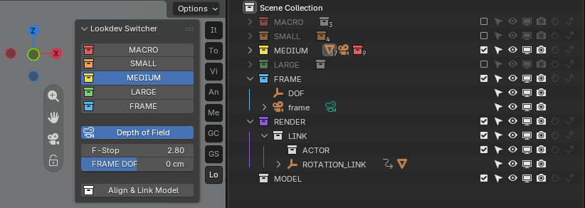

Three sections:

| Section | Purpose |
|---|---|
| Configuration buttons | Pick a scale: MACRO, SMALL, MEDIUM, LARGE, FRAME |
| Depth of Field | Focus and aperture for all cameras |
| Align & Link Model | Rig an imported model for the turntable |

---

## Switching configurations

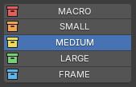

One click on `MACRO`, `SMALL`, `MEDIUM` or `LARGE`:

- shows that collection and everything inside it
- hides the other four
- switches the scene camera to the matching one

The active button stays pressed, so you can always see where you are.

**About the colours.** Each button takes its colour from the collection's own
colour tag in the outliner. Recolour a collection there and the button follows —
they can't drift apart.

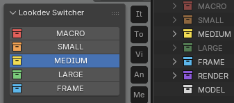

### The four scales

<!-- TODO: one line each on the intended use -- what MACRO is for, what LARGE is
for. The renders show the difference; the words should say when to reach for
which. -->

| | | |
|---|---|---|
| **MACRO** |  | |
| **SMALL** |  | |
| **MEDIUM** |  | |
| **LARGE** |  | |

---

## Framing a model

`FRAME` does everything the other buttons do, and then fits the camera to your
model: 150 mm, centred, filling as much of the frame as possible without
cropping.

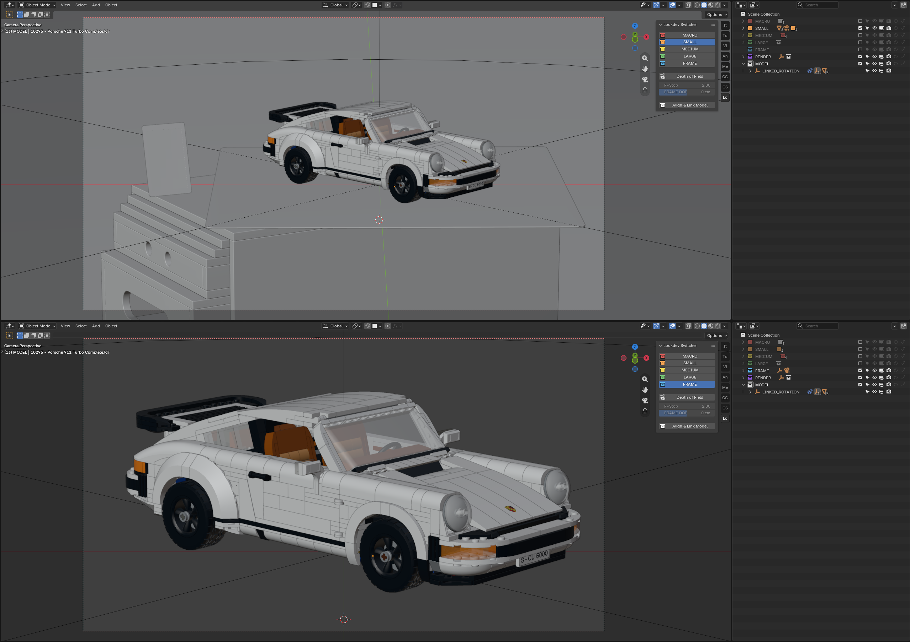

**What gets framed:**

| Your selection | What FRAME fits |
|---|---|
| Nothing selected | everything in `MODEL` |
| Meshes inside `MODEL` selected | just those |
| Something outside `MODEL` selected | the whole selection |

So you can frame a whole car, or just its wheel, by selecting it first.

### Why it measures twice

Your model turns. Seen head-on a car is narrow; side-on it is wide. A framing
that fits the head-on view would cut the car in half a moment later.

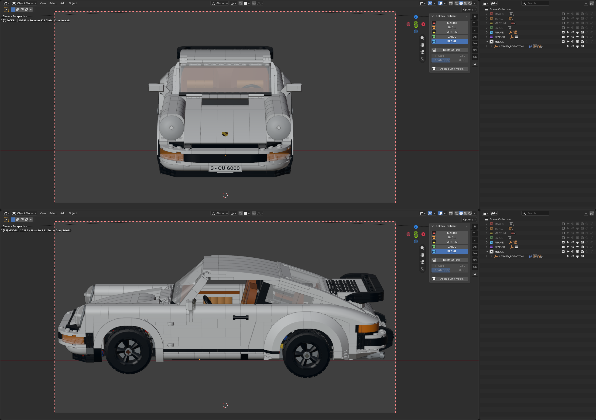

FRAME therefore measures at **frame 0 and frame 75** and fits both at once. The
limiting one wins — whichever needs more room decides the distance. In testing,
fitting only frame 0 left the car sticking about 55 % out of frame at the side
view.

Whether the width or the height touches the edge depends on your model against
your render format. A wide, flat model fills the width; a tall one fills the
height. You never have to choose.

---

## Depth of field

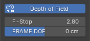

| Control | What it does |
|---|---|
| **Depth of Field** | Switches DOF on or off for all five cameras at once |
| **F-Stop** | The aperture. Lower = shallower focus, more blur |
| **FRAME DOF** | Moves the focus point towards or away from the camera |

**FRAME DOF** slides the `DOF` empty from −200 cm to 200 cm; the `frame` camera
focuses on it. Drag for the usual range, or click the field and type a value
beyond it if you need to.

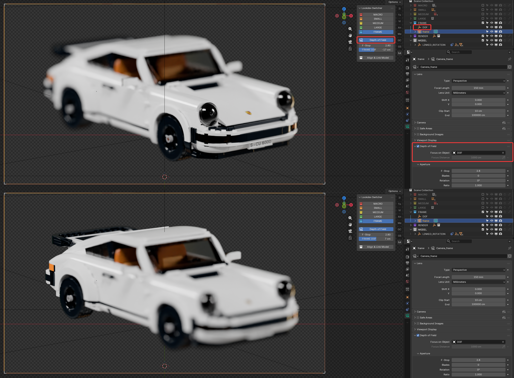

All three settings are saved with your file.

---

## Setting up your own model

The whole point: bring in a model, get a turntable.

### 1. Import

Import your model and put it in the **`MODEL`** collection. Sub-collections are
fine — the tool looks inside them.

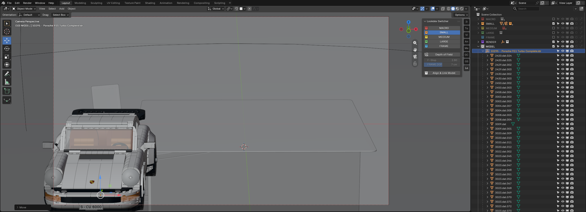

### 2. Press Align & Link Model

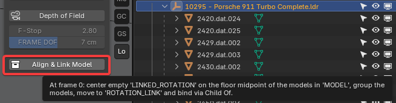

One press. It:

1. measures every **visible** mesh in `MODEL`
2. puts an empty called `LINKED_ROTATION` at the centre of your model, on the
   floor
3. groups everything under it
4. moves it onto the turntable rig and binds it

Your model now stands centred on the turntable and turns with it.

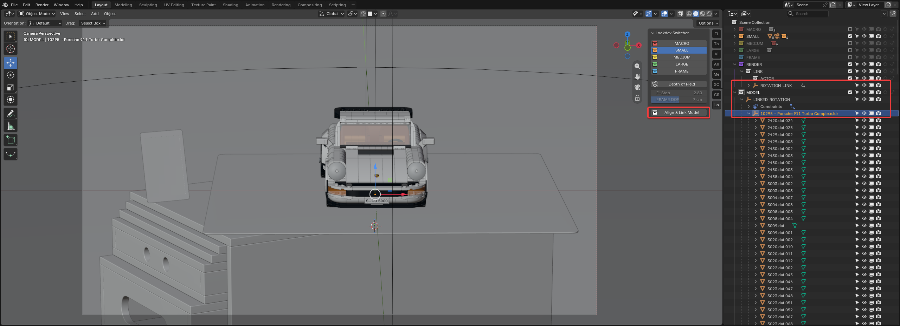

> **Press it once per model.** A second press would measure an already-grouped
> model and shift it. If you swap the model out, that's a fresh import — press
> it again for the new one.

**Hidden parts:** hidden meshes don't count towards the measurement, so
something you've switched off can't pull the centring off. They are still
grouped and still turn — otherwise they'd stand still while the rest rotates.

### 3. Frame and render

Press `FRAME` — or any of the four scales — and you're ready.

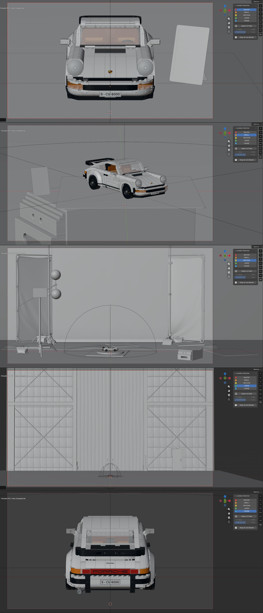

---

## What the conversion changed

For reference — what the setup script did to your downloaded scene. The complete
list is in the [Reference](DOCUMENTATION.md#what-the-conversion-changes).

### Cameras

The four camera objects already existed; they were given speaking data names:
`Camera_macro`, `Camera_small`, `Camera_medium`, `Camera_large`. A fifth camera,
`frame`, was added for the framing configuration.

### Collections

`FRAME` and `MODEL` were created, and the colour tags were tidied so the outliner
reads as a scale from red to green:

| Collection | Colour |
|---|---|
| `MACRO` | red |
| `SMALL` | orange |
| `MEDIUM` | yellow |
| `LARGE` | green |
| `FRAME` | blue |
| `RENDER` | violet |
| `MODEL` | neutral |

### Objects

`DOF` — the empty the frame camera focuses on. `frame` — the framing camera.
Both live in the `FRAME` collection.

### Modifiers

Two parts of the studio — the turntable plank and the carpet — got a Subdivision
Surface modifier, so they hold up under the closer camera scales.

### Render settings

The scene is set up for lookdev quality: **1024 samples**, all bounces at 32,
adaptive sampling with a 0.01 noise threshold, denoising on, light tree and
caustics on. Renders take longer than the original scene — that is deliberate.

GPU denoising is **not** switched on: whether that helps depends on your
graphics card, not on the scene. Turn it on yourself if you have one.

### Output and colour

Transparent film, 200 % resolution, centimetres, and ACES 2.0 colour management
with reference gamut compression. Renders are written as **multi-layer EXR**
(Float Half, DWAB) in ACEScg, next to your own `.blend` file.

If you would rather have PNG, change it in *Output Properties*. Nothing in the
panel depends on the format.

### Compositor

A **Film Grain** node was added after the existing colour group, preset to
16 mm / Studio Broadcast at ISO 400, and the tree rewired so it sits between the
grade and the output.

You can mute it (`M`) or delete it — nothing else depends on it.

---

## Troubleshooting

**The panel is gone after reopening the file.**
*Edit → Preferences → Save & Load → Auto Run Python Scripts* is off. Switch it on
— once, and it stays. Or open the Text Editor, pick `lookdev_switcher.py` and
press Run Script.

**The model is cut off while the turntable turns.**
Framing samples frames 0 and 75. A model with an unusual silhouette may need
more. In the Text Editor, open `lookdev_switcher.py` and widen:

```python
FRAME_CHECK_FRAMES = (0, 25, 50, 75)
```

**A button has the wrong colour.**
Colours come from the outliner. Change the collection's colour tag there and the
button follows.

**Renders are slow now.**
1024 samples with 32 bounces — lookdev quality. Lower *Render Properties →
Sampling → Render → Max Samples* if you only need a preview.

**My renders are EXR, not PNG.**
By design: multi-layer EXR in ACEScg, next to your `.blend`. Change it in *Output
Properties* if you prefer PNG.

**"view transform 'ACES 2.0' not available"**
Your Blender ships a different colour config. Everything else still applies —
only colour management was skipped.

**"node group 'Film Grain' not found"**
Film Grain ships with Blender as an Essentials asset, and the script could not
find it in your installation. Add it once by hand in the Compositor via
*Add → Group → Film Grain*, then run the script again. Everything else was
applied regardless.
